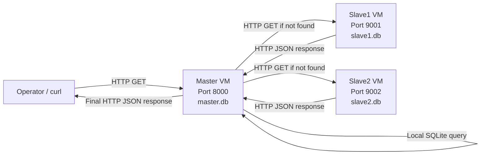
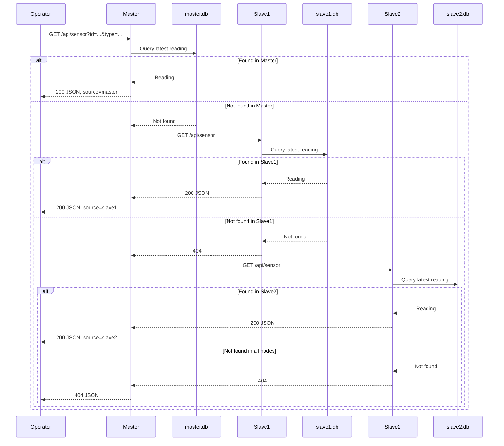

# Section 01 — Basic Distributed Database System

## Embedded Systems — Homework 04

This section implements a basic distributed sensor database using one **Master** node and two **Slave** nodes. Each node stores its own sensor data in a local SQLite database. The operator sends requests only to the Master. The Master checks its local database first and, if the requested sensor reading is not found, queries Slave1 and then Slave2 through HTTP.

The programs are written in C++17, use Mongoose for HTTP communication, and use SQLite for local storage.

---

## 1. Implemented Architecture

The system contains the following nodes:

- **Master**: receives operator requests, checks `master.db`, queries the Slave nodes when necessary, and returns the final response.
- **Slave1**: checks `slave1.db` and returns a local result to the Master.
- **Slave2**: checks `slave2.db` and returns a local result to the Master.

The API endpoint is:

```text
GET /api/sensor?id=<sensor_id>&type=<sensor_type>
```

Example:

```text
GET /api/sensor?id=101&type=temperature
```

---

## 2. Project Structure

```text
01/
├── data/
│   ├── master_sensors.csv
│   ├── slave1_sensors.csv
│   └── slave2_sensors.csv
├── logs/
│   ├── master.log
│   ├── slave1.log
│   └── slave2.log
├── master/
│   ├── config
│   ├── config.example
│   ├── http_client.cpp
│   ├── http_client.h
│   ├── main.cpp
│   ├── Makefile
│   ├── master_init_db.sh
│   └── master.db
├── mongoose/
│   ├── mongoose.c
│   └── mongoose.h
├── scripts/
│   ├── build_and_run.sh
│   ├── check_databases.sh
│   ├── init_all_databases.sh
│   ├── show_logs.sh
│   └── test_requests.sh
├── slave1/
│   ├── config
│   ├── config.example
│   ├── main.cpp
│   ├── Makefile
│   ├── slave1_init_db.sh
│   └── slave1.db
├── slave2/
│   ├── config
│   ├── config.example
│   ├── main.cpp
│   ├── Makefile
│   ├── slave2_init_db.sh
│   └── slave2.db
├── README.md
└── report.md
```

Generated object files, executables, databases, and logs may also appear after compilation and execution.

---

## 3. Installing the Required Dependencies

The expected operating system is Ubuntu 22.04.

Install the required packages on every VM:

```bash
sudo apt update
sudo apt install -y build-essential sqlite3 libsqlite3-dev curl coreutils
```

The packages provide:

- `g++`: compiles the C++ source files.
- `gcc`: compiles `mongoose.c`.
- `make`: builds the Master and Slave programs through their Makefiles.
- `sqlite3`: creates and inspects the SQLite databases.
- `libsqlite3-dev`: provides the SQLite development headers and library.
- `curl`: sends HTTP test requests.
- `stdbuf`: prevents delayed log output in `build_and_run.sh`.

Verify the installation:

```bash
g++ --version
gcc --version
make --version
sqlite3 --version
curl --version
```

Mongoose is included in the `mongoose/` directory and does not require a separate installation.

Grant execution permission to the Bash scripts:

```bash
chmod +x master/master_init_db.sh
chmod +x slave1/slave1_init_db.sh
chmod +x slave2/slave2_init_db.sh
chmod +x scripts/*.sh
```

---

## 4. Node Configuration

IP addresses, ports, database paths, and the Slave request timeout are read from configuration files. They are not hard-coded in the C++ source code.

### 4.1 Master configuration

Example `master/config` for three separate VMs:

```ini
PORT=8000
DATABASE=master.db
SLAVE_TIMEOUT_MS=3000

SLAVE1_IP=192.168.122.18
SLAVE1_PORT=9001

SLAVE2_IP=192.168.122.190
SLAVE2_PORT=9002
```

Replace the example addresses with the actual IP addresses assigned to the Slave VMs.

The Master also supports the optional shared-IP configuration:

```ini
PORT=8000
DATABASE=master.db
SLAVE_TIMEOUT_MS=3000

SLAVE_IP=127.0.0.1
SLAVE1_PORT=9001
SLAVE2_PORT=9002
```

When `SLAVE1_IP` or `SLAVE2_IP` is defined, the node-specific value overrides `SLAVE_IP`.

### 4.2 Slave1 configuration

`slave1/config`:

```ini
PORT=9001
DATABASE=slave1.db
```

### 4.3 Slave2 configuration

`slave2/config`:

```ini
PORT=9002
DATABASE=slave2.db
```

The configuration file path can be passed as the first program argument. When no argument is provided, the program uses a file named `config` in the current directory.

---

## 5. Initializing the SQLite Databases

The databases are created from the CSV files in the `data/` directory. The initialization scripts delete the previous database before recreating it, so repeated execution does not duplicate readings.

From the root of the `01` directory, initialize all databases:

```bash
./scripts/init_all_databases.sh
```

This command creates:

```text
master/master.db
slave1/slave1.db
slave2/slave2.db
```

The corresponding input files are:

```text
data/master_sensors.csv
data/slave1_sensors.csv
data/slave2_sensors.csv
```

A different CSV directory can be supplied as an argument:

```bash
./scripts/init_all_databases.sh /path/to/csv_directory
```

The directory must contain files with the expected names.

Individual database initialization is also possible:

```bash
./master/master_init_db.sh \
    ./master/master.db \
    ./data/master_sensors.csv
```

```bash
./slave1/slave1_init_db.sh \
    ./slave1/slave1.db \
    ./data/slave1_sensors.csv
```

```bash
./slave2/slave2_init_db.sh \
    ./slave2/slave2.db \
    ./data/slave2_sensors.csv
```

Inspect all initialized databases:

```bash
./scripts/check_databases.sh
```

---

## 6. Compiling the Master and Slave Programs

Each node has an independent Makefile.

### 6.1 Compile the Master

```bash
make -C master clean
make -C master
```

Generated executable:

```text
master/master
```

### 6.2 Compile Slave1

```bash
make -C slave1 clean
make -C slave1
```

Generated executable:

```text
slave1/slave1
```

### 6.3 Compile Slave2

```bash
make -C slave2 clean
make -C slave2
```

Generated executable:

```text
slave2/slave2
```

Compile all nodes:

```bash
for node in master slave1 slave2; do
    make -C "$node" clean
    make -C "$node"
done
```

---

## 7. Running the Programs

### 7.1 Running all nodes on one machine

For local development, configure the Master to use `127.0.0.1` and different ports, then run:

```bash
./scripts/build_and_run.sh
```

The script performs the following operations:

1. Initializes all SQLite databases from the CSV files.
2. Compiles the Master, Slave1, and Slave2 programs.
3. Starts all three nodes.
4. Writes their output to the `logs/` directory.
5. Stops all nodes when `Ctrl+C` is pressed.

While the script is running, open another terminal to send requests or run the test script.

### 7.2 Running the system on three VMs

The recommended startup order is:

1. Start Slave1.
2. Start Slave2.
3. Start the Master.
4. Send requests only to the Master.

#### On the Slave1 VM

```bash
cd /path/to/01
make -C slave1
cd slave1
./slave1 config
```

#### On the Slave2 VM

```bash
cd /path/to/01
make -C slave2
cd slave2
./slave2 config
```

#### On the Master VM

```bash
cd /path/to/01
make -C master
cd master
./master config
```

The programs listen on `0.0.0.0`, so they accept connections through the VM network interface on the port defined in their configuration file.

---

## 8. Sending Requests to the Master

The operator must send requests only to the Master.

General request format:

```bash
curl -i \
    "http://<MASTER_IP>:<MASTER_PORT>/api/sensor?id=<SENSOR_ID>&type=<SENSOR_TYPE>"
```

For local execution, use `127.0.0.1:8000`.

### 8.1 Reading a sensor stored in the Master

```bash
curl -i \
    "http://127.0.0.1:8000/api/sensor?id=101&type=temperature"
```

Expected source field:

```json
{
  "source": "master",
  "data": {
    "sensor_id": "101",
    "sensor_type": "temperature",
    "sensor_name": "Floor1_Room101_Temp",
    "location": "Floor1_Room101",
    "value": "24.8",
    "unit": "C",
    "recorded_at": "2026-06-01 10:15:00"
  }
}
```

### 8.2 Reading a sensor stored in Slave1

```bash
curl -i \
    "http://127.0.0.1:8000/api/sensor?id=204&type=co2"
```

The response contains:

```json
{
  "source": "slave1",
  "data": {
    "sensor_id": "204",
    "sensor_type": "co2"
  }
}
```

### 8.3 Reading a sensor stored in Slave2

```bash
curl -i \
    "http://127.0.0.1:8000/api/sensor?id=304&type=smoke"
```

The response contains:

```json
{
  "source": "slave2",
  "data": {
    "sensor_id": "304",
    "sensor_type": "smoke"
  }
}
```

### 8.4 Requesting a sensor that does not exist

```bash
curl -i \
    "http://127.0.0.1:8000/api/sensor?id=999&type=temperature"
```

Expected response:

```json
{
  "error": "sensor reading not found in any node"
}
```

Expected HTTP status:

```text
404 Not Found
```

### 8.5 Invalid request

```bash
curl -i \
    "http://127.0.0.1:8000/api/sensor?id=101"
```

Expected response:

```json
{
  "error": "id and type query parameters are required"
}
```

Expected HTTP status:

```text
400 Bad Request
```

---

## 9. Database Structure

Each node has a local SQLite database with the same schema.

### 9.1 `node_info`

Stores information about the node itself.

```sql
CREATE TABLE node_info (
    id INTEGER PRIMARY KEY AUTOINCREMENT,
    node_name TEXT NOT NULL,
    node_role TEXT NOT NULL,
    description TEXT,
    created_at TEXT DEFAULT CURRENT_TIMESTAMP
);
```

Important fields:

- `node_name`: `master`, `slave1`, or `slave2`.
- `node_role`: `MASTER` or `SLAVE`.
- `description`: short description of the node.

### 9.2 `sensors`

Stores the static metadata of each sensor.

```sql
CREATE TABLE sensors (
    sensor_id TEXT PRIMARY KEY,
    sensor_type TEXT NOT NULL,
    sensor_name TEXT NOT NULL,
    location TEXT,
    unit TEXT,
    node_name TEXT NOT NULL,
    is_active INTEGER NOT NULL DEFAULT 1
);
```

### 9.3 `sensor_readings`

Stores the recorded values of the sensors.

```sql
CREATE TABLE sensor_readings (
    id INTEGER PRIMARY KEY AUTOINCREMENT,
    sensor_id TEXT NOT NULL,
    value TEXT NOT NULL,
    recorded_at TEXT NOT NULL,
    created_at TEXT DEFAULT CURRENT_TIMESTAMP,
    FOREIGN KEY (sensor_id) REFERENCES sensors(sensor_id)
);
```

The application finds the newest reading by ordering matching records by:

```sql
ORDER BY recorded_at DESC, id DESC
LIMIT 1
```

The following indexes improve lookup speed:

```sql
CREATE INDEX idx_sensors_type_id
    ON sensors(sensor_type, sensor_id);

CREATE INDEX idx_readings_sensor_time
    ON sensor_readings(sensor_id, recorded_at DESC);
```

Example manual inspection:

```bash
sqlite3 -header -column master/master.db \
    "SELECT * FROM sensors ORDER BY sensor_id;"
```

```bash
sqlite3 -header -column master/master.db \
    "SELECT * FROM sensor_readings ORDER BY sensor_id, recorded_at;"
```

---

## 10. Network Diagram

### 10.1 Three-VM deployment



Text version:

```text
                         Private LAN

+------------+       +------------------+
| Operator   | ----> | Master VM        |
| curl       | HTTP  | IP:<MASTER_IP>   |
+------------+       | Port:8000        |
                     | master.db        |
                     +--------+---------+
                              |
                 +------------+------------+
                 |                         |
                 v                         v
        +------------------+      +------------------+
        | Slave1 VM        |      | Slave2 VM        |
        | IP:<SLAVE1_IP>   |      | IP:<SLAVE2_IP>   |
        | Port:9001        |      | Port:9002        |
        | slave1.db        |      | slave2.db        |
        +------------------+      +------------------+
```

The operator is not expected to communicate directly with the Slave APIs. Firewall rules should restrict Slave access to the Master IP.

### 10.2 Shared-IP deployment

```text
127.0.0.1:8000  -> Master
127.0.0.1:9001  -> Slave1
127.0.0.1:9002  -> Slave2
```

This mode is useful for local development and implements the optional shared-IP/different-port challenge.

---

## 11. Request and Response Path

The request flow is sequential:

1. The operator sends `GET /api/sensor` to the Master.
2. The Master validates the `id` and `type` query parameters.
3. The Master searches its local SQLite database.
4. If the reading is found, the Master immediately returns HTTP `200` with `"source":"master"`.
5. If the reading is not found, the Master sends the same request to Slave1.
6. If Slave1 returns HTTP `200`, the Master returns the data to the operator with `"source":"slave1"`.
7. If Slave1 returns HTTP `404`, the Master sends the request to Slave2.
8. If Slave2 returns HTTP `200`, the Master returns the data with `"source":"slave2"`.
9. If every node returns “not found,” the Master returns HTTP `404`.
10. If a database error, connection error, unexpected HTTP response, or Slave timeout prevents a complete distributed search, the Master returns HTTP `503`.

Sequence diagram:



---

## 12. Testing the Program

### 12.1 Automated request tests

Start all nodes first. Then, from another terminal, run:

```bash
./scripts/test_requests.sh
```

The test script checks the following cases:

1. A reading found in the Master.
2. A reading found in Slave1 through the Master.
3. A reading found in Slave2 through the Master.
4. A reading not found in any node.
5. A request with a missing `type` parameter.
6. An unknown API route.

A successful result ends with:

```text
Passed: 6
Failed: 0
All tests passed successfully.
```

For a Master running on another VM, provide its address through `MASTER_HOST`:

```bash
MASTER_HOST=<MASTER_IP> ./scripts/test_requests.sh
```

A different Master configuration file can be supplied through `MASTER_CONFIG`:

```bash
MASTER_CONFIG=/path/to/master/config \
MASTER_HOST=<MASTER_IP> \
./scripts/test_requests.sh
```

### 12.2 Database tests

Check the schema, row counts, and latest sensor readings:

```bash
./scripts/check_databases.sh
```

### 12.3 Network connectivity tests

From the Master VM:

```bash
ping -c 4 <SLAVE1_IP>
ping -c 4 <SLAVE2_IP>
```

Check the ports:

```bash
nc -zv <SLAVE1_IP> 9001
nc -zv <SLAVE2_IP> 9002
```

If `nc` is not installed:

```bash
sudo apt install -y netcat-openbsd
```

### 12.4 Manual failure test

Stop one Slave and request data that belongs to it. The Master should detect that the distributed lookup could not be completed and return:

```text
HTTP 503
```

```json
{
  "error": "distributed query could not be completed"
}
```

### 12.5 Viewing logs

```bash
./scripts/show_logs.sh
```

The log files are:

```text
logs/master.log
logs/slave1.log
logs/slave2.log
```

The Master log shows when a request is forwarded to Slave1 or Slave2.

---

## 13. HTTP Security Review and Possible Improvements

The current implementation uses plain HTTP and is intended for an educational LAN environment. Plain HTTP does not encrypt the request path, query parameters, headers, or response body. A device on the same network may be able to observe or modify the traffic.

### 13.1 Current security limitations

- No TLS encryption.
- No operator authentication.
- No authentication between the Master and Slaves.
- No authorization or role-based access control.
- No request-rate limitation.
- The servers listen on `0.0.0.0`.
- The Slave ports may be reachable directly unless firewall rules are applied.
- Sensor identifiers and returned values are transferred as readable text.

### 13.2 Security mechanisms already present in the implementation

- Query parameters are validated before database access.
- SQLite prepared statements and bound parameters are used instead of constructing SQL queries from user input.
- The HTTP client uses a configurable timeout for Slave requests.
- Invalid routes and invalid inputs receive explicit HTTP error responses.
- IP addresses, ports, database paths, and timeouts are external configuration values.

### 13.3 Recommended improvements

1. **Use HTTPS/TLS**

   Configure Mongoose with TLS certificates and replace `http://` endpoints with `https://` endpoints. TLS provides confidentiality and integrity for operator-to-Master and Master-to-Slave traffic.

2. **Authenticate API requests**

   Require an API key, signed token, or another authentication mechanism for operator requests.

3. **Authenticate node-to-node communication**

   Use mutual TLS or a shared-secret authorization header so that Slave nodes accept requests only from the trusted Master.

4. **Apply firewall restrictions**

   Slave1 should accept TCP port `9001` only from the Master IP, and Slave2 should accept TCP port `9002` only from the Master IP.

   Example on Slave1:

   ```bash
   sudo ufw default deny incoming
   sudo ufw allow from <MASTER_IP> to any port 9001 proto tcp
   sudo ufw enable
   ```

   Example on Slave2:

   ```bash
   sudo ufw default deny incoming
   sudo ufw allow from <MASTER_IP> to any port 9002 proto tcp
   sudo ufw enable
   ```

5. **Limit operator access to the Master**

   Allow port `8000` only from the operator network or a trusted management host.

6. **Add rate limiting and request-size limits**

   This reduces the risk of denial-of-service attacks and excessive resource consumption.

7. **Protect configuration and database files**

   Apply restrictive file permissions:

   ```bash
   chmod 600 master/config slave1/config slave2/config
   chmod 600 master/master.db slave1/slave1.db slave2/slave2.db
   ```

8. **Avoid logging secrets**

   Authentication tokens and confidential sensor data should not be written to logs.

9. **Use network segmentation**

   Place the three nodes in a private VLAN or isolated virtual network and expose only the Master to the operator.

---

## 14. Common Errors

### Configuration file not found

Run the program from the correct node directory or pass an explicit path:

```bash
cd master
./master config
```

### SQLite database not found

Initialize the databases:

```bash
./scripts/init_all_databases.sh
```

### Address already in use

Check which process owns the ports:

```bash
ss -lntp | grep -E ':8000|:9001|:9002'
```

Stop the old process or change the configured port.

### Distributed query could not be completed

Check:

- Whether both Slave programs are running.
- Whether the Master configuration contains the correct IP addresses and ports.
- Whether the Slave ports are reachable from the Master.
- Whether the firewall allows Master-to-Slave traffic.
- Whether `SLAVE_TIMEOUT_MS` is large enough for the network.

### Unexpected `404`

Confirm the sensor identifier and type in the database:

```bash
sqlite3 -header -column master/master.db \
    "SELECT sensor_id, sensor_type FROM sensors ORDER BY sensor_id;"
```

---

## 15. Suggested Final Demonstration

A short final test video can show:

1. The IP address of each VM.
2. Database initialization.
3. Compilation through Makefiles.
4. Starting Slave1, Slave2, and the Master.
5. A request found in the Master.
6. A request found in Slave1.
7. A request found in Slave2.
8. A request not found in any node.
9. Execution of `test_requests.sh` with all tests passing.
10. The Master log showing request forwarding.

The implementation details do not need to be explained in the video; only the commands and visible results are required.

---

## 16. README and Report Scope

This README is the operational guide for Section 01. It explains installation, configuration, database initialization, compilation, execution, request submission, testing, the network diagram, the request path, and the HTTP security review.

The separate `report.md` should provide a more detailed design-oriented discussion, including:

- The system objectives and design decisions.
- The distributed architecture and responsibilities of each node.
- Analysis of the supplied CSV data and database schema.
- Communication and failure-handling strategy.
- Actual test outputs and interpretation of the results.
- Network and request-flow diagrams.
- Security and reliability analysis.
- Final conclusions.

The report should describe the system from the designer's point of view and should not explain the source code line by line.